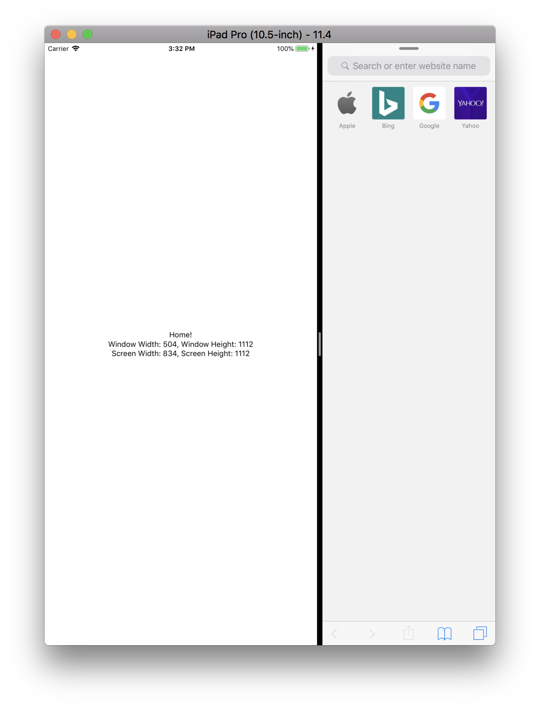

# Window vs. Screen (React Native)

## Run It:

```bash
yarn && react-native run-ios --simulator 'iPad Pro (10.5-inch)'
```

## What to Look For:

1) When running in full screen, window and screen dimensions should be equal.
1) When running in split view, window should represent the app/window dimensions (smaller) and screen dimensions should represent the full screen.

## Screenshot:


